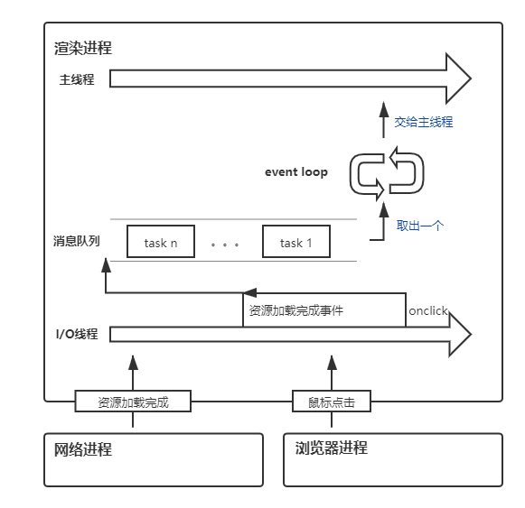

# 浏览器事件循环与任务

## 浏览器事件循环

在介绍 event loop 之前，再看一下浏览器架构：

1. 浏览器进程：负责各种 I/O 交互、子进程管理、资源存储等

2. 网路进程：负责网络资源加载

3. 渲染进程：负责页面渲染、javascript 执行等

其中由渲染进程的主线程负责处理各种任务如渲染（解析 dom、布局...）、javascript 执行、网络请求等等

主线程一次只能处理一个任务，而且各个任务的执行时间各不相同。为了保证按顺序逐一处理各种事件，引入了消息队列（或称任务队列）和事件循环（event loop）的机制，事件循环负责从消息队列中每次拿出一个任务交给主线程执行，而由 I/O 操作、网络请求、文件读写等操作产生的事件，只需要按顺序依次放入消息队列即可



上述操作保证了执行不会混乱，但是消息队列无法处理需要延迟一段时间后再执行的任务（如 settimeout）。针对这种情况，可以再维护一个延迟队列（实际应该是 hash map 结构）存放延时的任务，在处理一个任务（task）后，会检查延迟队列是否有到期任务（task），如果有则取出执行

```javascript
void ProcessTimerTask(){
  //从delayed_incoming_queue中取出已经到期的定时器任务
  //依次执行这些任务
}

TaskQueue task_queue；
void ProcessTask();
bool keep_running = true;
void MainTherad(){
  for(;;){
    //执行消息队列中的任务
    Task task = task_queue.takeTask();
    ProcessTask(task);
    
    //执行延迟队列中的任务
    ProcessDelayTask()

    if(!keep_running) //如果设置了退出标志，那么直接退出线程循环
        break;
  }
}
```

在保证了按顺序执行和延迟执行后，如果在执行一个任务时，发现一个需要立即处理的事件e该怎么办呢？我们不能将它放入消息队列，因为会将它排到 task n 后面；如果用 settimeout(fn，0)，那么当 fn 里再次产生需要立即处理的事件 e 时，两次 e 事件中间可能插入很多浏览器添加的网络、I/O 等其它任务

为了在执行一个任务过程中，处理需要立即执行的操作（或者说命令），而不打断当前任务的继续执行（假设此时正在渲染页面，若需要网络请求的结果，则需当前渲染之后，再执行）。引入了微任务（micro task）的概念，V8 引擎在执行 javascript 代码时，会产生全局执行上下文，同时会在内部维护一个微任务队列。在 javascript 执行结束，准备退出全局上下文，调用栈为空时，会检查微任务队列，依次执行微任务直到队列为空，javascript 执行任务结束，主线程开始执行下一个任务

任务与微任务分类：

| 任务（task/micro task） | 微任务（micro task） |
| --- | --- |
| setTimeout | Mutation Observer |
| setInterval | Promise.[then | catch | finally] |
| I/O操作如鼠标点击 | process.nextTick |
| setImmediate | queueMicrotask |
| script（整体代码块） ||
| 渲染页面 ||

注意：

1. setTimeout、setInterval 维护在延迟队列中，同样属于任务（task），但是会在一个任务结束后，判断延迟队列中是否有到期的定时器，有的话就全部执行。而不是创建了定时器，就将其排到消息队列

2. 对于event（假设监听了一个 click 事件）：

    - 如果是由web api自动触发（例如点击鼠标）回调函数执行，此时会将 click 事件包装成一个任务放入消息队列，在这个任务中，会按照事件冒泡依次将事件的回调函数放入 JS 调用栈执行

    - 如果是由程序触发（script：elemen.click()）回调函数执行，则会将 script 放入 JS 调用栈，事件回调函数按照冒泡的顺序同步触发，所有函数执行完，才算 element.click() 执行结束

接下来按照 Promise A+ 规范实现一下Promise，规范说明，Promise只有三种状态：pending、reject、fullfield，且只能从pending转化为fullfield和reject，不能颠倒。当状态改变时，会调用之前注册在then或catch中的回调函数

参考：
1. https://jakearchibald.com/2015/tasks-microtasks-queues-and-schedules/?utm_source=html5weekly
2. https://time.geekbang.org/column/article/134456

