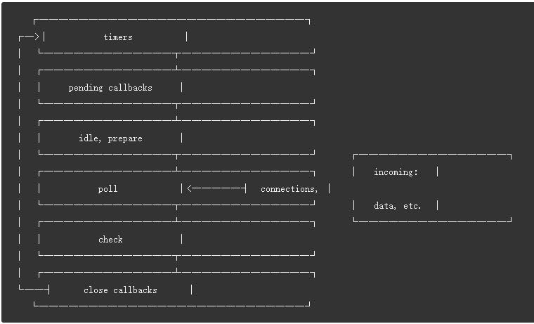

# Node 事件循环

Node 做为 JavaScript 运行时，由 libuv 的 uv_run 函数实现了事件循环机制

在执行 Node 程序时，先执行所有同步代码，然后进入事件循环，事件循环结束意味着 Node 执行结束



事件循环分为不同阶段（phase），每个阶段都有一个回调队列：

1. 定时器（timer）阶段：处理 setTimeout 和 setInterval，定时器是以最小堆实现的，最快过期的节点是根节点。在每轮事件循环开始的时候都会缓存当前的时间，用这个缓存的时间查找到期的 timer 回调执行

2. pending 阶段：执行上一轮循 Poll IO 阶段没有执行的回调函数。（例如数据写入成功，tcp 连接失败等操作的回调）

3. poll IO 阶段：此阶段有 2 个任务，一是计算需要阻塞的时间并等待 IO 事件，二是执行回调队列（poll queue）中的回调。事件循环进入此阶段，会阻塞等待 IO 事件，在阻塞期间如果有到期的 timer 回调，则返回到定时器阶段，或者如果有 setimmediate 回调，则进入到 check 阶段执行 immediate 回调。否则处理 IO 时间回调

4. check 阶段：处理 setImmediate，Poll IO 若为空，同时有 immediate 任务，则执行 immediate 任务。

5. close callback 阶段：执行一些清理函数

设置 setTimeout 为 0，Node 会自动将其时间改为 1，所以 setTimeout(cb,0) 和 setImmediate(cb) 执行顺序，主要取决于 setTimeout 注册 cb 到执行 cb 期间，系统操作的耗时。但是如果将其都注册到 IO 操作的回调函数中，则由上面对 Poll IO 的描述可知，IO 操作结束后 setImmediate 一定会先执行

```javascript
// test.js start
  setTimeout(() => {
      console.log('setTimeout')
  }, 0);

  setImmediate(() => {
      console.log('setImmediate')
  })
// 输出顺序不定
// test.js end

// test.js start
  const fs = require('fs')

  fs.open('./test.html',(err, fd) => {
      setTimeout(() => {
          console.log('setTimeout')
      }, 0);

      setImmediate(() => {
          console.log('setImmediate')
      })
  })
// 先输出 setTimeout 后输出 setImmediate
// test.js end
```

上面第一次执行 node test.js，输出顺序取决于 timer 阶段和 check 阶段系统间隔是否大于 1ms，第二次执行，由于是在 poll IO 阶段注册的回调函数，setTimeout 被注册到下轮循环中，setImmediate 被注册到下个阶段，所以 IO 操作结束后，先执行 setImmediate

process.nextTick 不属于 event loop 的一部分。在任何阶段调用 nextTick 注册的回调函数，会放入一个队列中，并在 event loop 进入下一阶段前，全部取出执行

```javascript
setTimeout(() => {
    console.log('setTimeout')
    process.nextTick(() => {
        console.log('timeout nextTick 1')
        process.nextTick(() => {
            console.log('timeout nextTick 2')
        })
    })
}, 0);

setImmediate(() => {
    console.log('setImmediate')
    process.nextTick(() => {
        console.log('immediate nextTick 1')
    })
})

// setTimeout
// timeout nextTick 1
// timeout nextTick 2  
// setImmediate        
// immediate nextTick 1
```

Node 16 后微任务表现和浏览器中一致，即在每个任务执行后如果微任务队列非空，则清空微任务队列：

```javascript
setTimeout(() => {
    console.log('t-1')
    Promise.resolve()
        .then(() => {console.log('t-1 p-1')})
        .then(() => {console.log('t-1 p-2')})
    process.nextTick(() => {
        console.log('t-1 next-1')
    })
}, 0)

setTimeout(() => {
    console.log('t-2')
    Promise.resolve()
        .then(() => {console.log('t-2 p-1')})
        .then(() => {console.log('t-2 p-2')})
    process.nextTick(() => {
        console.log('t-2 next-1')
    })
}, 0)

// t-1
// t-1 next-1
// t-1 p-1
// t-1 p-2
// t-2
// t-2 next-1
// t-2 p-1
// t-2 p-2
```

参考：
1. https://jakearchibald.com/2015/tasks-microtasks-queues-and-schedules/?utm_source=html5weekly
2. https://time.geekbang.org/column/article/134456

