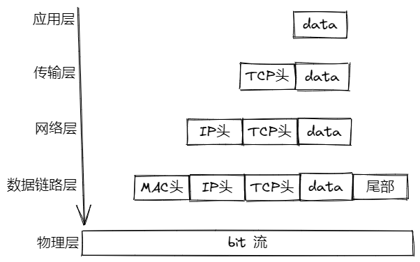
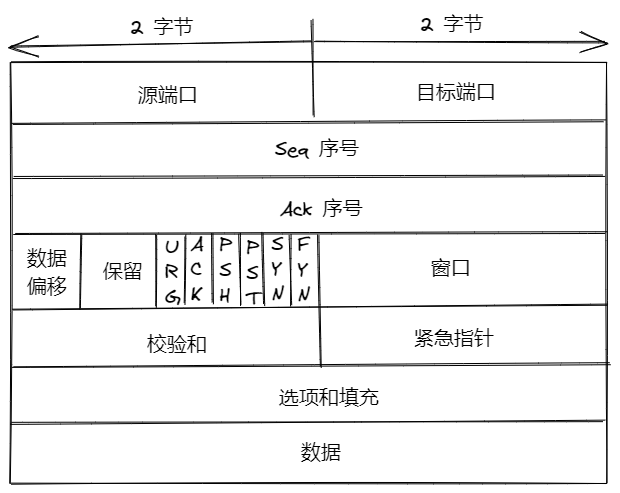
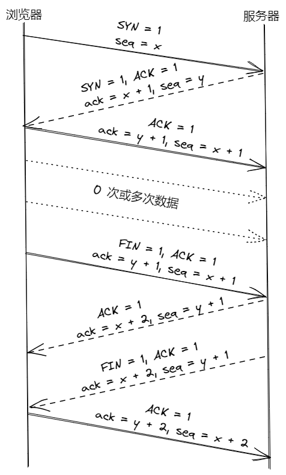
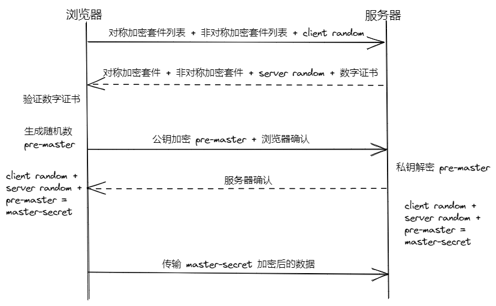
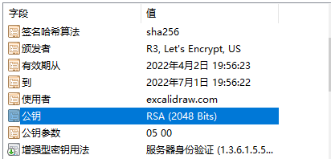

# 网络协议

为了在两台计算机之间传递数据，需要一套统一的标准，这就是网络协议的作用

## 五层网络模型

为了方便学习和理解，将 OSI 模型基础概括为五层

1. 应用层（application layer）：指的是应用进程间的交互，如万维网应用 HTTP 协议、文件传送 FTP 协议等，一般应用层交互的数据单元叫报文（message）

2. 传输层（transport layer）：为应用层提供通用的数据传输服务，主要包括 TCP 和 UDP 协议

3. 网络层（network layer）：为分组交换网上不同主机提供通信服务，把传输层的报文段封装成组或包（packet）传输

4. 数据链路层（data link layer）：将网络层的数据报组装成帧，在节点间传输

5. 物理层：传输比特数据

数据在传输中可能经过多个设备，每个设备中数据都会经过这 5 层中的某几层处理，最终到达目标地址

## TCP

然后将报文交给传输层处理，以 TCP 协议为例，传输层会将报文数据分段处理，在每段上加 TCP 头，包括源端口号、目标端口号、序列号等

TCP 是面向连接的、可靠的、基于字节流的传输层通信协议：

  - 面向连接：数据传输之前需要验证是否可以传输数据，以保证可以双向传递字节流

  - 可靠：会对数据进行摘要，保证数据不会修改，并增加序列号，保证数据不会缺失

TCP 协议会在数据前加上 TCP 头，包含如下组成部分：

1. 源端口和目标端口加上 IP 首部中的源地址和目标地址，确定一个唯一的 TCP 连接

2. seq 序号：发送数据的第一个字节的序号

3. ack 序号：期望对方下次发送数据第一个字节的序号，只有 ACK 标志为 1 时，才有效

4. 数据偏移：TCP 首部长度

5. 标志位：各 1 位长

  - URG：为 1 时表示此段尽快传送，与紧急指针共用

  - ACK：为 1 时 ack 序号才有效

  - PSH：为 1 时，接收方应尽快将本报文段推送给应用层

  - RST：为 1 时表示出现连接错误，必须释放连接

  - SYN：SYN=1，ACK=0 时表示请求建立一个连接 

  - FIN：发送端完成发送任务，在关闭TCP连接的时候使用

6. 窗口：TCP 用来进行流量控制，发送端对所有数据帧按顺序赋予编号，在发送过程中保持一个发送窗口，落在发送窗口内的帧才允许发送，接收端维持一个接收窗口，落在窗口内的帧才允许接收

7. 校验和：发送端计算、接收端验证保证数据准确性

在传输数据前需要通过三次握手和四次挥手建立连接

+ 3 次握手：

  - 浏览器发送 SYN = 1，ACK = 0 与请求服务器建立连接，同时发送浏览器端序列号 seq = x

  - 服务器发送 SYN = 1 请求与浏览器建立连接，同时发送 ACK = 1 使 ack = x + 1 序列号可以使用，并发送服务器端序列号 seq = y

  - 浏览器回应 ACK = 1 同意与服务器建立连接，同时发送 ack = y + 1，seq = x + 2 序列号

此时，浏览器、服务器均验证了与对方发送消息是可行的，建立了双工连接。

一段时间后，假设浏览器传输数据完成，则调用 close 关闭连接，此时会经历 4 次挥手阶段：

+ 4 次挥手：

  - 浏览器发送 FIN = 1，ACK = 1 表示想要断开连接，上图一次传输，中间未传输其它数据，所以 ack = y + 1，seq = x + 1

  - 服务器若有数据传输则先回复一个 ACK = 1，若没有数据传输，此次传输可能不存在

  - 服务器调用 close 关闭与浏览器的连接，发送 FIN = 1，ACK = 1

  - 浏览器确认与服务器端断开连接，发送 ACK = 1

至此，一次 TCP 传输完成，要注意断开连接时挥手可能为 4 次也可能为 3 次，与服务器是否仍有数据需要发送有关

## HTTPS

HTTPS 在 HTTP 和 TCP 间增加了一个安全层，以保证明文 HTTP 数据不会在传输过程中被中间人攻击

HTTPS 采用非对称加密 + 对称加密 + CA 认证的方式实现数据的加密，大致过程如下：

1. 浏览器将可用的对称/非对称加密套件列表和随机数发给服务器

2. 服务器选择对称/非对称加密套件并将 CA 证书一起发给浏览器，CA 证书包括两部分：
  - 由服务器公钥、组织信息、证书序列号等明文信息
  - CA 使用 Hash 对明文信息计算摘要，并用私钥加密摘要信息，得到数字签名

3. 浏览器验证数字证书：
  - 用 Hash 计算 CA 证书的明文信息得到摘要 A
  - 用 CA 的公钥解密 CA 的数字签名得到摘要 B，对比摘要 A 和 B

4. 验证成功后，生成随机数 pre-master 并用服务器的公钥加密后传给服务器

5. 浏览器和服务器分别用得到的 client-random、server-random、pre-master 计算出 master-secret

6. 用 master secret 加密传输的数据
