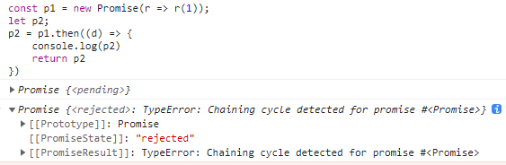

# Promise

Promise 被设计用来执行异步任务，避免回调地狱的产生。[Promise/A+](https://promisesaplus.com/) 规范被广泛采用来实现 Promise，借助 `promises-aplus-test` 可以测试能否全部通过规范

## 状态

Promise 有三种状态（pending、fulfilled、rejected），pending 可以转化成 fulfilled 或 rejected，但 fulfilled 和 rejected 不可转化成其它状态，并且在这两种状态中必须有一个值（value）或原因（reason）。

当我们 new Promise 时会传入一个 excutor，接收 resolve、rejected 函数作为参数，并立即执行 excutor 所以我们可以写出如下代码

```javascript
const Pending = 'pending';
const Fulfilled = 'fullfield';
const Rejected = 'reject';

class Mpromise {
    constructor(excutor) {
        this.status = Pending;
        // 存储成功的值
        this.value = null;
        // 存储失败的原因
        this.reason = null;
        // 存储成功回调
        this.fulfilledQueue = [];
        // 存储失败回调
        this.rejectedQueue = [];

        try {
            excutor(this._resolve, this._reject);
        } catch (error) {
            this.reject(error);
        }
    }

    _resolve = (value) => {
        if (this.status === Pending) {
            this.status = Fulfilled;
            this.value = value;
            // 改变promise状态，并执行所有回调函数
            this.fulfilledQueue.forEach(callback => callback(this.value));
        }
    }

    _reject = (reason) => {
        if (this.status === Pending) {
            this.status = Rejected;
            this.reason = reason;

            this.rejectedQueue.forEach(callback => callback(this.value));
        }
    }
}
```

## then 方法

Promise 必须提供一个 then 方法接收 Promise 状态改变后返回的值（value）或原因（reason），
接受两个函数参数（onFulfilled，onRejected），这两个参数有如下要求：

+ 必须都是可选的函数，否则忽略

+ 必须在 Promise 状态改变后才执行，且只执行一次

+ 必须在当前执行上下文（execution context）中代码执行完毕后执行，这意味着所有同步代码执行完才执行 then 注册的代码，需要 Promise 维护一个任务队列（task-scheduling queue）。这也就保证了 then 注册的回调函数的异步性。

+ 必须作为函数执行，this 没有值

then 函数需要满足如下条件：

+ 可能对同一个 Promise 执行多次：

```javascript
const p = new Promise(r => r(1))
p.then(() => {})
p.then(() => {})
```

此时当状态变化时，需要执行所有注册的 onFulfilled 或 onRejected

+ 必须返回一个 promise，`promise2 = promise1.then(onFulfilled, onRejected)`

- 当 onFulfilled 或 onRejected 不是函数时，且 promise1 是 fulfilled 或 rejected 时，promise2 变为带有相应 value 或 reason 的状态

- 若 onFulfilled 或 onRejected 抛出一个错误，promise2 变为带有相应 reason 的 rejected 状态

- 若 onFulfilled 或 onRejected 返回一个值，执行 [[Resolve]](promise, x)

```javascript
class Mpromise {
    // other code
    then = (onFulfilled, onRejected) => {
        // 未传回调时处理
        onFulfilled = typeof onFulfilled === 'function' ? onFulfilled : value => value;
        onRejected = typeof onRejected === 'function' ? onRejected : reason => { throw reason };

        // 链式处理 promise2 = promise1.then(onFulfilled,onRejected)
        const promise2 = new Mpromise((resolve, reject) => {
            if (this.status === Fulfilled) {
                setTimeout(() => {
                    try {
                        const x = onFulfilled(this.value);
                        // [[Resolve]](promise, x)
                        resolvePromise(promise2, x, resolve, reject);
                    } catch (error) {
                        reject(error)
                    }
                });
            } else if (this.status === Rejected) {
                setTimeout(() => {
                    try {
                        const x = onRejected(this.reason);

                        resolvePromise(promise2, x, resolve, reject);
                    } catch (error) {
                        reject(error)
                    }
                });
            } else if (this.status === Pending) {
                this.fulfilledQueue.push(() => {
                    setTimeout(() => {
                        try {
                            const x = onFulfilled(this.value);

                            resolvePromise(promise2, x, resolve, reject);
                        } catch (error) {
                            reject(error)
                        }
                    })
                })

                this.rejectedQueue.push(() => {
                    setTimeout(() => {
                        try {
                            const x = onRejected(this.reason);

                            resolvePromise(promise2, x, resolve, reject);
                        } catch (error) {
                            reject(error)
                        }
                    })
                })
            }
        });
    }
}
```

我们修改后的代码如上，用 2 个数组保存 then 注册的回调函数，这样当状态改变时，就可以在相应的数组里找到回调执行

我们的 then 函数需要传递 promise1 的状态到返回的 promise2 中，因此向数组中推入自定义的函数，注意此时对于 then 需要满足的第 2 条，第 3 点我们没有处理，只是单纯将返回值赋给了 x，它可以抽象成 [[Resolve]](promise, x) 的形式，有如下要求：

+ 如果 promise 与 x 指向同一个对象，抛出 TypeError 错误



+ 如果 x 是一个 promise 实例，promise 需要与 x 保持状态一致

+ 如果 x 不是对象或函数，promise 需要变成 fulfilled 状态，值为 x

+ 如果 x 是对象或函数，拿到 `then = x.then` 执行

- 执行抛出异常 e，promise 变为 reject(e)

- then 不是函数，promise 变为 resolve(x)

- then 是函数，执行 `then.call(x, resolvePromise, rejectPromise)`，参数满足如下条件：

    - rejectPromise 被调用参数为 r，promise 变为 reject(r)

    - resolvePromise 被调用参数为 y，执行 [[Resolve]](promise, y)

    - resolvePromise 和 resolvePromise 都被调用，或多次调用，则取第一次调用结果，其它忽略

    - then 调用出错 e 时，若 resolvePromise 和 rejectPromise 已经被调用过则忽略错误，否则将 promise 变为 reject(r)

```javascript
function resolvePromise(p2, x, resolve, reject) {
    if (p2 === x) {
        reject(new TypeError('can not return same promise'));
    }

    if (x instanceof Mpromise) {
        x.then(resolve, reject)
        return
    }

    let called = false;

    if (x !== null && ((typeof x === 'object') || (typeof x === 'function'))) {
        try {
            const then = x.then;
            if (typeof then === 'function') {
                // y可能为值、promise、thenable对象
                then.call(
                    x,
                    function (y) {
                        if (called) return;
                        called = true;
                        resolvePromise(p2, y, resolve, reject);
                    },
                    function (reason) {
                        if (called) return;
                        called = true;
                        reject(reason);
                    });
            } else {
                // 普通对象和函数
                resolve(x);
            }
        } catch (error) {
            if (called) return;
            reject(error);
        }
    } else {
        // 值
        resolve(x)
    }
}
```

我们将之前的代码改造下，先将生成 x 的操作提成函数方便我们后续操作，然后按照规则的要求，逐一判断：

1. x 和 promise2 想等则抛出错误

2. x 非对象和函数，将 promise2 变成 fulfilled 状态，值为 x

3. x 是 Mpromise 实例时，promise 需要与 x 保持状态一致

4. x 是 thenable 对象时，直接执行 x.then，注意此时对 y 的处理，不能直接 `y => resolve(y)` 处理，这样会导致不论 y 为何值，promise2 都会变成 fulfilled 状态。执行 x.then 

不难发现，在链式调用时 `p2 = p1.then`，p2 的状态是由 then 中 onFulfilled 执行时返回值决定的

## 其它静态方法

接下来继续完善 Mpromise，增加 resolve、all 等静态方法

```javascript
class Mpromise {
    static resolve(value) {
        if (value instanceof Mpromise) {
            return value
        }

        // 如果 value 不是 Mpromise 实例，p2 变为 fulfilled
        const p2 = new Mpromise((r,j) => {
            resolvePromise(p2, value, r, j)
        })
        return p2
    }

    static reject(reason) {
        return new Mpromise((_, reject) => reject(reason))
    }

    catch(onRjected) {
        return this.then(null, onRejected)
    }

    static all(promises) {
        const resultList = [];
        let count = 0;
        const p2 = new Mpromise((resolve, reject) => {
            promises.forEach(promise => {
                promise.then(
                    value => {
                        count++;
                        resultList.push(value);

                        if (count === promises.length) {
                            resolve(resultList);
                        }
                    }, 
                    reason => {
                        reject(reason)
                    }
                )
            });
        })

        return p2
    }

    static reace = (promises) => {
        const p2 = new Mpromise((resolve, reject) => {
            promises.forEach(promise => {
                promise.then(
                    value => resolve(value), 
                    reason => reject(reason)
                )
            })
        })

        return p2
    }
}
```
