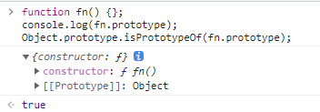

# 原型与原型链

首先简要概括两个概念: 
  - 类: 对数据和其相关操作的抽象
  - 原型: 给其它对象提供公有属性的对象，或者说是创建对象的模板

## 构造函数、原型和原型链

原型: 创建一个函数 `function fn() {}`，会同时创建一个 `fn.prototype` 对象，代表这个函数的原型对象。原型对象默认会有 `constructor` 属性指回 `fn`，其它所有属性、方法都继承自 `Object.prototype`



每次调用构造函数创建一个新实例 `o`，这个实例内部的 `[[Prototype]]` 属性就会指向构造函数的原型对象，可以通过 `Object.getPrototypeOf(o)` 或 `o.__proto__` 的方式访问 `o` 的 `[[Prototype]]`

`Fn.prototype` 是一个对象，是 `Object` 构造函数构造出的实例，因此 `Fn.prototype.__proto__ === Object.prototype`，而 `Object` 的原型不是任何其它对象的实例，所以 `Object.prototype.__proto__ === null`

当我们将 `fn` 当做构造函数使用，创建实例 `o` 时，`o` 可以访问 `fn.prototype` 中的所有属性和方法。当访问一个 `o` 自身没有的属性时，就会沿着 `o` 的原型向上逐级查找，直到查找到 `Object.prototype.__proto__` 也就是 `null`，依然找不到时，就会返回 `undefined`。这条查找链就是常说的原型链

```javascript
function f() {
	this.a = 'a'
};

f.prototype.name = 'f';

const f1 = new f();

console.log(f1) // { a : 'a' }
console.log(f1.name) // 'f', 查找f1 -> f.prototype
console.log(f1.age) // undefined, 查找f1 -> f.prototype -> Object.prototype -> null
```

函数实现继承几种方式: 
1. 原型链继承: 由于属性的访问是沿着原型链查找的，所以可以手动设置原型链实现继承
```javascript
function Parent() {
	this.eat = {
  	apple: 1
  }
};
Parent.prototype.name = 'parent';

function Child() {};
Child.prototype = new Parent();

const c = new Child();
console.log(c.name); // 'parent'

c.eat.apple = 2;
console.log(c.eat); // { apple: 2 }
```

通过将 `Child` 的原型指向 `Parent` 的实例的方式，构造了 `c.__proto__` ->` Child.prototype` -> `(instance Parent).__proto__` ->` Parent.prototype` 这样一条原型链。`c` 继承了 `Parent` 实例和原型上的所有属性和方法
但是这种方式由几点不足: 
    1. 无法在实例化 `Child` 时给 `Parent` 传递参数，若 `Parent` 中某些属性需要基于参数构造，此时无法实现  2. 如果 `Parent` 实例属性是引用类型，可能会被 `c` 更改  3. `Child.prototype.constructor !== Child` 即原型混乱了
    2. 构造函数绑定继承: 主要是为了解决上面提到的问题 2，解决思路是在子构造函数中执行父构造函数方法。并将子类实例作为父构造函数的上下文

```javascript
function Parent(name) {
  this.name = name;
	this.eat = {
  	apple: 1
  }
}

function Child(name) {
	Parent.call(this, name);
}

const c = new Child('zzz');
c.eat.apple = 2;

const c2 = new Child('hhh');
console.log(c2.eat) // { apple : 1 }
```

以上即可继承父类实例属性，并解决父类属性需要根据参数构建的问题。但同时，这种方式无法继承父类原型上的属性和方法

3. 组合继承: 即将 1、2 两种继承方式组合起来，通过构造函数绑定继承实例属性，通过原型链继承原型上的属性和方法

```javascript
function Parent(name) {
	this.name = name;
}
Parent.prototype.age = 66;

function Child(n) {
	Parent.call(this, n);
}
Child.prototype = new Parent();
Child.prototype.constructor = Child;

const c = new Child('zzz');
console.log(c.name) // 'zzz'
console.log(c.age) // 66
```

4、原型式继承: 通过创建新的引用指向父类的方式，拿到父类的属性function object(o) {

```javascript
function F() {};
  F.prototype = o;
  return new F();
}

const public = {
	a: 1
}

const o1 = object(public);
const o2 = object(public);
o1.a = 2;
console.log(o2.a); // 2;
```

`o1`、`o2` 都继承了父类的方法和属性，缺点是两个子类实例均可改变父类。由于 `Object.create(father)` 方法就是把返回的对象 `child.__proto__ = father`，所以由 `Object.create` 创造的对象，只不过多了一层包裹，同样有上述问题

4. 原型式继承 + 组合继承: 在组合继承中，分两次调用了父构造函数（`Father.call()和new Father()`），也有一点难看，考虑结合原型式: 

```javascript
function Parent() {};

function Child() {
	Parent.call(this);
}

Child.prototype = Object.create(Parent.prototype);
Child.prototype.constructor = Child;
```

严格来说如果不通过 `c.__proto__.__proto__` 这种方式修改，是无法改变 `Parent.prototype` 的，也可以说是目前为止较好的一种继承方式了。其它如深拷贝、浅拷贝实现的继承，不在这里赘述
## 类和类的继承
ES6 定义了 JS 实现类的关键字 `class`，本质是构造函数的语法糖

1. 类的组成和使用: 

```javascript
class A {
    attr = '顶层定义实例属性'
    static attr = '顶层定义静态属性，调用方式A.attr'
    #attr = '定义私有属性，仅在类内部通过this.#attr使用，目前处于stage3'

    constructor(props) {// 构造函数，相当于function A，内部定义实例属性和方法
    this.attr2 = 'constructor内实例属性';
    this.method = function () { console.log('实例方法') };
    console.log(new.target, '一般用在constructor中，表示new作用的构造函数');
    }

    method2() {// 相当于A.prototype.method2
    console.log('原型上的方法')
    }

    static method3() {
    console.log('静态方法，通过A.method3调用，this指向类A')
    }

    #method4() {
    console.log('私有方法，仅通过this.#method4()调用')
    }

    get attr3() {
    console.log('相当于Object.defineProperty(A, attr3, { get... })')
    }

    set attr3(val) {
    console.log('同get')
    }
}
```

2. 通过 `extends` 实现继承:

```javascript
class Parent {}
class Child extends Parent {
	constructor(props) {
  	super(props);
    this.attr = 'Child attr'
  }
}
```

要在子类中使用 `this`，必须先调用 `super()`，原因如下: 

    - ES5中继承的实现，是先创建子类的this，然后再将父类的方法添加到子类上（Parent.call(this)）而ES6中子类的this必须先通过父类的构造函数完成塑造，得到与父类同样的实例属性和方法，子类再修饰这个this

super关键字既可以当作函数使用，也可以当作对象使用: 

a 作为函数: 只能在构造函数中使用，代表父类构造函数，但是返回的是子类实例。即 `super` 内部的 `this` 指的是 `B` 的实例，因此 `super()` 在这里相当于 `Parent.prototype.constructor.call(this)`

```javascript
class Parent {
    constructor() {
        console.log(new.target.name);
    }
}
class Child extends Parent {
    constructor() {
    super();
    }
}
new Parent() // Parent
new Child() // Child
```
b、作为对象: 
  1. 在普通方法中super指向A.prototype。此时调用A.prototype.method方法时，method内部的this指向当前的子类实例  
  2. 在静态方法中super指向A。在子类的静态方法中通过super调用父类的方法时，方法内部的this指向当前的子类，而不是子类的实例
  
```javascript
class Parent {
    name = 'parent'
    static age = 66
    method() {
        console.log(this.name)
    }
    static method2() {
        console.log(this.name)
    }
}

class Child extends Parent {
    constructor() {
        super();
        this.name = 'child';
        super.method();
    }

    static name = 'CHILD'
    static age = 19

    static method2() {
        console.log(super.age);
        super.method2();
    }
}

const c = new Child(); 
Child.method2(); 
// 'child'
// 66
// 'CHILD'
```

3、类的 `__proto__` 和 `prototype`: 
`class` 作为构造函数的语法糖，同时有 `prototype` 属性和 `__proto__` 属性，因此同时存在两条继承链
    1. 子类的 `__proto__` 属性，表示构造函数的继承，总是指向父类
    2. 子类 `prototype` 属性的 `__proto__` 属性，表示方法的继承，总是指向父类的 `prototype` 属性

```javascript
class Parent {
}

class Child extends Parent {
}

Child.__proto__ === Parent // true
Child.prototype.__proto__ === Parent.prototype // true
```

这是因为类的继承主要是通过

```javascript
Object.setPropertyOf(Child.prototype, Parent.prototype);
Object.setPrototypeOf(Child, Parent);
```

这种方式实现的，相当于设置 `__proto__` 属性
不存在任何继承的情况下，由于A就是一个普通函数，所以继承自 `Function.prototype`。但是 `A` 调用后返回空对象，所以 `A` 的原型继承自 `Object.prototype`
```javascript
class A {
}

A.__proto__ === Function.prototype // true
A.prototype.__proto__ === Object.prototype // true
```

## __proto__、prototype关系图
上面已经概括了属性的作用: 
  ○ prototype:: 创建函数同时被创建，代表需要被对象使用的公共属性和方法  ○ __proto__: 实例特有，指代[[Prototype]]属性，代表实例的原型，原型也可通过Object.getPrototypeOf获取
现在可以画出由这两个属性描绘的原型链了: 