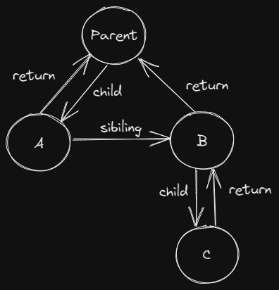

# react 执行过程

react 16 引入了 Fiber，可以让我们在递归挂载子节点时中断递归过程，减少页面卡顿的出现

当创建组件时，不再需要显示调用 React.createElement，React 会自动帮我们创建 JSX 对象

render 过程就是递归遍历子组件创建元素并插入页面，下面是简化代码

```javascript
function render(vnode, container) {
    wipRoot = {
        stateNode: container,
        props: {
            children: vnode
        }
    }

    nextUnitWork = wipRoot;
}
```

Fiber 是 React 16 新引入的，我们可以将它看作数据结构，可以根据 Fiber 创建虚拟节点 VNode，亦可以看成一种执行机制，当浏览器有空时将从上次的 Fiber 继续执行

## Reconciler

我们利用 requestIdleCallback 代替 Scheduler，当浏览有空闲时，开始 Reconciler 过程，协调是根据 Fiber 来的，每次浏览器有空我们就从上次执行的 Fiber 开始继续协调

协调过程可以分为 render 和 commit 两个阶段

```javascript
requestIdleCallback(workloop)
function workloop(deadline) {
    // let shouldYield = false
    while (nextUnitWork && deadline.timeRemaining() > 1) {
        nextUnitWork = performUnitWork(nextUnitWork)
    }

    requestIdleCallback(workloop);
}
```

## render

render 阶段主要是渲染子元素，并构建 Fiber 树：

1. 如果有 children 就遍历 children
2. 第一个 children 作为当前 Fiber 的 child，后续的 children 作为第一个 children 的 sibiling



```javascript
const INSERT = 'insert';
const UPDATE = 'update';
const DELETE = 'delete';
function performUnitWork(workInPrograss) {
    // beginWork(workInPrograss)
    if (typeof workInPrograss.type === 'function') {
        updateFunctionComponent(workInPrograss);
    } else {
        updateHostComponent(workInPrograss);
    }

    if (workInPrograss.child) {
        return workInPrograss.child
    }

    let nextFiber = workInPrograss
    while (nextFiber) {
        // completeWork(workInPrograss) 收集effect
        if (nextFiber.sibiling) {
            return nextFiber.sibiling;
        }

        nextFiber = nextFiber.return;
    }
}
function updateFunctionComponent(workInPrograss) {
    const { type, props } = workInPrograss;

    const children = type(props);
    reconcilerChildren(workInPrograss, children);
}
function updateHostComponent(workInPrograss) {
    if (!workInPrograss.stateNode) {
        workInPrograss.stateNode = createNode(workInPrograss);
    }

    reconcilerChildren(workInPrograss, workInPrograss.props.children);
}
function reconcilerChildren(workInPrograss, children) {
    if (!(workInPrograss.props && typeof workInPrograss.props.children !== 'string')) {
        return
    }

    const newChildren = Array.isArray(children) ? children : [children];
    let preFiber = null;
    // 第一个老的子节点
    let oldFiber = workInPrograss.base && workInPrograss.base.child;
    newChildren.forEach((child, index) => {
        let newFiber = null;
        const same = child && oldFiber && child.type === oldFiber.type;
        // 新旧 fiber 相同
        if (same) {
            newFiber = {
                type: child.type,
                stateNode: oldFiber.stateNode,
                props: child.props,
                child: null,
                return: workInPrograss,
                sibiling: null,
                base: oldFiber,
                tag: UPDATE
            }
        }
        // 新增插入
        if (!same && child) {
            newFiber = {
                type: child.type,
                stateNode: null,
                props: child.props,
                child: null,
                return: workInPrograss,
                sibiling: null,
                base: null,
                tag: INSERT
            }
        }
        // 删除
        if (!same && oldFiber) {
            oldFiber.tag = DELETE;
            delations.push(oldFiber)
        }

        if (oldFiber) {
            oldFiber = oldFiber.sibiling;
        }

        if (index === 0) {
            workInPrograss.child = newFiber;
        } else {
            preFiber.sibiling = newFiber;
        }

        preFiber = newFiber;
    })
}
```

### 根据 Fiber 创建 dom 节点

```javascript
function createNode(fiber) {
    let node = null;
    if (typeof fiber.type === 'string') {
        node = document.createElement(fiber.type);
    }

    node && updateNode(node, {}, fiber.props);

    return node;
}

function updateNode(node, oldProps, props) {
    Object.keys(oldProps)
        .forEach(key => {
            if (key === 'children') {
                if (typeof props[key] === 'string') {
                    node.innerHTML = '';
                }
            } else {
                if (key.slice(0, 2) === 'on') {
                    const eventName = key.slice(2).toLowerCase();
                    node.removeEventListener(eventName, oldProps[key])
                } else {
                    if (!(key in props)) {
                        node[key] = ''
                    }
                }

            }
        });

    Object.keys(props)
        .forEach(key => {
            if (key === 'children') {
                if (typeof props[key] === 'string') {
                    const text = document.createTextNode(props[key]);
                    node.appendChild(text);
                }
            } else {
                if (key.slice(0, 2) === 'on') {
                    const eventName = key.slice(2).toLowerCase();
                    node.addEventListener(eventName, props[key])
                } else { node[key] = props[key] }

            }
        });
}
```

## commit

commit 从 root 开始，深度优先将 Fiber 的 stateNode 插入到页面

```javascript
let currentRoot = null
function workloop(deadline) {
    // other code
    if (!nextUnitWork && wipRoot) {
        commit();
    }
    // other code
}

function commit() {
    commitWork(wipRoot.child);
    currentRoot = wipRoot;
    wipRoot = null;
}

function commitWork(fiber) {
    if (!fiber) {
        return;
    }

    let parentFiber = fiber.return;
    while (!parentFiber.stateNode) {
        parentFiber = parentFiber.return;
    }

    const parentNode = parentFiber.stateNode
    if (fiber.tag === INSERT && fiber.stateNode) {
        parentNode.appendChild(fiber.stateNode)
    } else if (fiber.tag === UPDATE && fiber.stateNode) {
        updateNode(fiber.stateNode, fiber.base.props, fiber.props)
    } else if (fiber.tag === DELETE && fiber.stateNode){
        commitDelation(fiber, parentNode);
    }

    commitWork(fiber.child);
    commitWork(fiber.sibiling);
}

function commitDelation(workInPrograss, parentNode) {
    if (workInPrograss.stateNode) {
        parentNode.removeChild(workInPrograss.stateNode)
    } else {
        commitDelation(workInPrograss.child, parentNode);
    }
}
```

## hooks

在 updateFunctionComponent 时，会执行函数组件，此时 hook 会执行

设置一个全局标志 wipFiber 代表 workInProgress，就可以拿到 Fiber 上保存的状态

### useState & useReducer

useState 是 useReducer 的特殊实现，有 2 个功能，一是返回上一次更新时的状态，二是改变 state 并触发更新

每次函数组件更新都会重新执行所有 hook，所以如果用数组（源码是链表）保存每个 hook，如果位置不变，则每次更新都可以得到上次 hook 返回的状态

```javascript
let wipFiber = null;
function updateFunctionComponent(workInPrograss) {
    // other code
    wipFiber = workInPrograss;
    wipFiber.hooks = [];
    wipFiber.hooksIndex = -1;
    // other code
}
function useReducer(reducer, initialArg, init) {
    const oldHook = wipFiber.base && wipFiber.base.hooks[wipFiber.hooksIndex]
    const initialAction = 'infint'
    const initialState = 
        !!init && typeof init === 'function' 
            ? init(initialArg) 
            : initialArg  
    const hook = oldHook 
        ? {
            state: oldHook.state,
            queue: oldHook.queue
          } 
        : {
            state: initialState,
            queue: []
          }

    hook.queue.forEach(action => {
        hook.state = action
    })

    wipFiber.hooks.push(hook)
    wipFiber.hooksIndex++

    function dispatch(action) {
        const oldState = hook.state
        const newState = reducer(oldState, action)
        if (!Object.is(newState, oldState)) {
            hook.queue.push(newState)
            // 从根节点开始更新
            wipRoot = {
                stateNode: currentRoot.stateNode,
                props: currentRoot.props,
                base: currentRoot
            }
            nextUnitWork = wipRoot;
            delations = [];
        }
    }
    return [hook.state, dispatch]
}

function useState(initialState) {
    return useReducer((_, action) => action, initialState)
}
```

### useMemo & useCallback

useMemo 在依赖项改变时重新计算并返回参数 fn 的结果，useCallback 是 useMemo 的特殊情况

```javascript
function useMemo(fn, deps) {
    let oldHook = wipFiber.base && wipFiber.base.hooks[wipFiber.hooksIndex]
    let result
    if (oldHook) {
        const { value, deps: oldDeps } = oldHook
        const same = oldDeps.every((item, index) => item === deps[index])
        if (!same) {
            result = fn()
            wipFiber.base.hooks.push({value: result, deps})
        }
        wipFiber.hooksIndex++
    } else {
        result = fn()
        wipFiber.base.hooks.push({value: result, deps})
        wipFiber.hooksIndex++
    }

    return result
}

function useCallback(fn, deps) {
    return useMemo(() => fn, deps)
}
```

### useEffect

useEffect 是在更新 DOM 后执行，即在 commit 阶段执行，执行时会先清理所有 useEffect 的销毁函数，再执行回调函数

先用 setTimeout 模拟一下更新后

* Attention：此处是简单实现，不是源码

```javascript
function useEffect(cb, deps) {
    let oldHook = wipFiber.base && wipFiber.base.hooks[wipFiber.hooksIndex]
    if (oldHook) {
        const [destory, oldDeps] = oldHook
        const same = deps.every((item, index) => item === oldDeps[index])
        if (!same) {
            destory && destory()
            setTimeout(() => {
                oldHook = [cb(), deps]
                wipFiber.hooks.push(oldHook)
                
            })
        }
        wipFiber.hooksIndex++
    } else {
        setTimeout(() => {
            oldHook = [cb(), deps]
            wipFiber.hooks.push(oldHook)
            wipFiber.hooksIndex++
        })
    }
}
```
