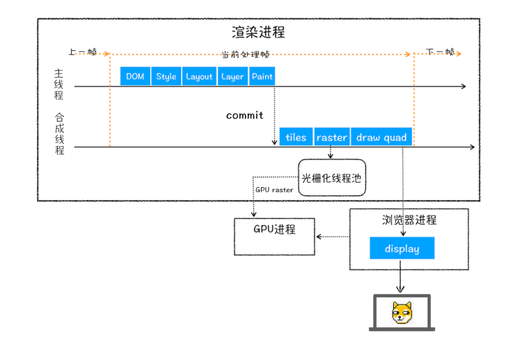
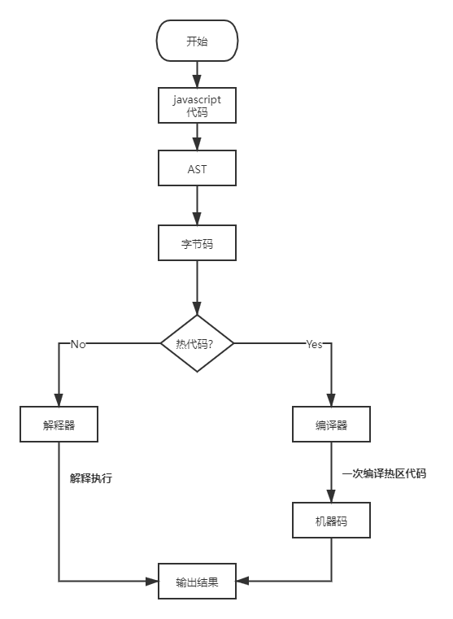
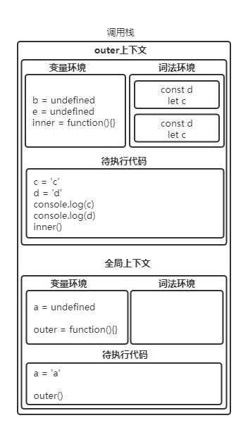
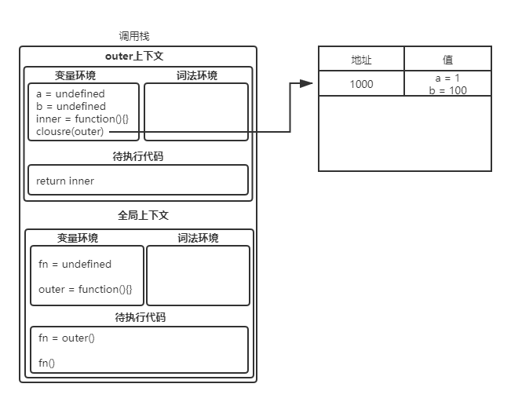
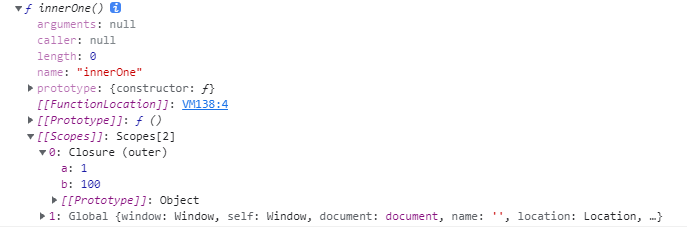

# JS 在浏览器执行过程

打开一个页面，并在 Chrome 上更多工具 --> 任务管理器，可以看到工作进程：


1. 浏览器进程：负责界面展示、用户交互、子进程管理，及存储等功能

2. 渲染进程：运行在沙箱模式下，每个 tab 对应一个渲染进程，负责将 HTML、CSS、Javascript 转化
为可以交互的网页，排版引擎与 v8 引擎都在该进程下工作

3. GPU 进程：为浏览器提供操作GPU的能力

4. 网络进程（Network Process）：负责页面的网络资源加载

渲染进程的主线程（main thread）在执行过程中，会将渲染操作按时间顺序分成多个子阶段依次进行，包括构建 DOM 树、样式计算、布局阶段、分层、绘制、分块、光栅化和合成

1. 构建 DOM 树：负责将 HTML 结构化标签转化为程序可处理的树结构，由各种节点对象构成，我们用 element.children 实际就是遍历 DOM 树的查找过程

2. 样式计算：首先将 CSS 文件、内联 css 样式转换为标准的 styleSheets 结构，便于查询和修改。其次，要进行属性值的标准化，如 `color:geen` 转化为 `color:rgb(0,128,0)`。最后，根据 css 继承和层叠的规则，计算出 DOM 节点中每个元素具体样式，保存在 ComputedStyle 结构中，可用 `element.computedStyle` 查看。（继承指的是如 fontsize 属性，若已经在父元素设置，子元素不设置也可继承该属性的值；层叠指对不同来源的 css，最终使用哪一个来源）

3. 布局阶段：根据 DOM 树和 styleSheets，创建布局树（layout tree）并计算元素的几何位置。布局树包含可见元素（去除 `<head>`、display:none 元素）及各元素的样式

4. 构建图层树：为了展示 3D 效果、滚动效果等，需要对布局树分层
    - 拥有层叠上下文的元素单独一层（opacity、filter、z-index 等属性会创建层叠上下文）

    - 内容超出父元素高度时，内容为单独一层，有滚动条时，滚动条单独一层

5. 图层绘制：渲染引擎会将图层绘制拆分成一系列绘制指令，然后再将这些绘制指令，组成绘制列表（Layers 标签下选择 documents 层，拖动可体验绘制过程）

6. 栅格化（raster）：绘制列表准备好后，主线程会将绘制列表提交给合成线程进行绘制，
    - 图层分块：目的是只绘制视口（view port）可见部分的图层，节约开销

    - 生成位图：栅格化线程池内，将视口附近图块转换为位图，该过程会用 GPU 加速生成，并将生成的位图保存在 GPU 内存中

7. 合成和显示：所有图块都栅格化后，合成线程会生成绘制图块命令“DrawQuad”提交给浏览器进程。浏览器 viz 组件根据该命令，将 GPU 中内容绘制到内存中，再显示到屏幕上



JavaScript 执行流程

JavaScript 是一门动态、弱类型语言，它不要求在声明变量时指明变量是 int 或者 long 类型，它会在执行时确定变量是 number 或 string 类型，并且你可以给一个变量赋值不同的类型，例如 `var a = 1；a = "string"`

在执行一段代码前（JavaScript文件），首先会对其编译，生成 AST 和执行上下文（此时只编译顶层代码，不包含嵌套函数声明），AST 是计算机可以处理的结构化的代码，然后解释器会将AST转换为字节码，接着解释器解释执行代码，如果一段代码反复被执行多次，会将其标记成热代码，交给编译器生成机器码并存在内存中，这样下次执行时直接执行机器码即可，提升执行效率



浏览器内存模型可划分为栈内存、堆内存。其中栈内存存储执行上下文，堆内存存储引用类型数据，如 object、function

浏览器通过执行上下文知道当前正在执行什么函数，执行上下文由变量环境、词法环境和待执行代码构成，包含了函数执行期间会用到的变量、函数等

在每次函数fn执行前生成执行上下文，并推入栈中，浏览器将指针指向当前执行上下文，在函数执行后，将指针指向之前的执行上下文，这样 fn 的执行上下文可以在下次其它函数执行时被替换或者被垃圾回收

作用域指的是变量的可访问性和生命周期（包括全局作用域、函数作用域、with 构成的作用域、块作用域）。javascript 遵从词法作用域（在词法分析阶段就确定了作用域），这意味着变量的作用域是由代码中函数声明的位置决定的，而不是由调用的位置决定的。例如：

```javascript
var a = 1;

function inner() {
    console.log('全局作用域a：',a);
}

function outer(){
    var a = 2;
    console.log('函数作用域a：',a)
    {
        var a = 3;
        console.log('块作用域a：',a)
    }
    inner();  
}

outer();
// 函数作用域a：2
// 块作用域a：3
// 全局作用域a：1
```

inner 虽然在 outer 内部调用，但是声明在 outer 外部，所以只能访问外部的 `a：1`

而指向外部作用域的引用保存在上下文中的外部环境（下文说明），这样深层的函数嵌套中的变量访问，就可沿着这个引用逐层向上查找，也就构成了作用域链

按上文所述，在每次函数调用前会生成执行上下文，包含变量环境、词法环境和待执行代码

1. 变量环境：包括var声明的变量、函数声明。其中var声明的变量会默认赋值undefined并存入上下文，这种行为表现为变量提升。函数声明会将函数定义存入变量环境，待用到函数时，再编译生成它的执行上下文。

2. 词法环境：包括let、const声明的变量，但不会赋默认值，只会将声明放入词法环境，此时没有进行词法绑定，所以在赋值前不可访问，表现为暂时性死区，访问会报引用错误。

3. 外部环境（outer）：指向外部作用域的引用。（由词法作用域决定）

4. this

5. 待执行代码：将被执行的表达式，如赋值、函数调用等。

下面来看一段代码：

```javascript
var a = 'a';

function outer() {
    console.log(b);
    console.log(inner);
    var b = 'b';
    let c = 'c';
    const d = 'd';
    {
        // 由于暂时性死区，此处会报引用错误
        // console.log(c);
        // console.log(d);
        var e = 'block e';
        let c = 'block c';
        const d = 'block d';
    }
    console.log(e);// block e
    console.log(c);// c
    console.log(d);// d

    function inner() {
        var b = 'inner b';
        console.log(b);// inner b
    }

    inner();
}

outer();
```

分析以上代码（暂时忽略 this、外部作用域引用）：

1. 全局编译：全局变量 `a`、`outer` 函数进入变量环境，若在 `a = 'a'` 执行前访问 `a`，打印 `undefined`

2. 执行 `outer` 前：取出全局中 `outer` 函数的定义，编译并生成执行上下文入栈。由于 let、const会绑定到最近的作用域中，所以对于函数内的变量 c、d 和 {...} 内的 c、d，分别创建单独的区域存放到词法环境中

3. 执行 `outer()`：结果如注释所示，执行 inner() 也会先创建 inner 的上下文，原理与 outer 类似，不再赘述



闭包：对于嵌套作用域来说，内部作用域可以引用外部作用域定义的变量，若在一个内部函数中，引用了外部作用域的变量，就创建了闭包，根据词法作用域，内部作用域总是可以访问外部作用域的变量，即使外部作用域已经销毁

```javascript
function outer() {
    var a = 1;
    var b = 100;
    function innerOne() {
        var c = a + 1;
        console.log(c);
    }


    function innerTwo() {
        var d = b + 1;
    }
    
    return innerTwo;
}


var fn = outer();
fn();// 2;
```
    
以上代码创建了一个简单的闭包。由词法作用域的规则，可以知道内部函数总可以访问外部变量。但是从调用栈的上下文角度来说，在 `outer()` 执行后，outer 的上下文应该销毁了，那么为什么执行 `fn()` 依然会打印 2 呢？


其实是在创建 outer 上下文时，通过词法扫描发现 inner（innerOne、innerTwo）用了 outer 的变量，编译器知道了这是一个闭包，所以在内存中创建了一个对象 closure，并将 `a = 1` 放了进去。函数inner 保存了对这个 closure 对象的引用，所以调用 inner 找变量 a 的值时，即使 outer 上下文消失了，也依然会在 closure 上找到a


在控制台执行上述代码，console.dir(innerOne)，即可发现在inner函数的作用域上保存着对Closure的引用



